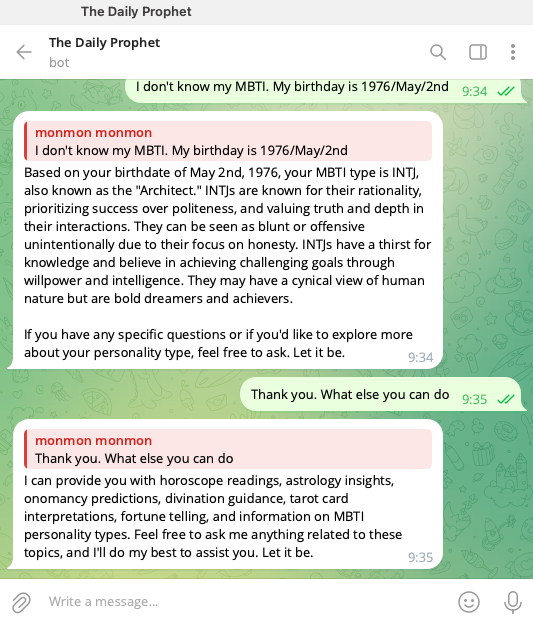

# AI Tele Chatbot

## Overview

This project is an AI assistant based on FastAPI and LangChain, capable of interacting with users in natural language and providing various emotion modes to enhance the interaction experience. It includes memory retention, internet search capabilities, and real-time WebSocket communication.The project includes a Telegram bot for remote interaction. The bot forwards user messages to the local FastAPI server and returns responses.

## Features

- **Natural Language Interaction**: Supports user queries and conversations.
- **Emotion Modes**: Includes multiple emotional states such as friendly, excited, angry, etc.
- **Memory Retention**: Remembers past conversations for context-aware responses.
- **Knowledge Search**: Uses local knowledge databases and web search for answering queries.
- **Text-to-Speech**: Generates speech output based on chat responses.
- **WebSocket Support**: Enables real-time interaction.

## Installation Guide

### Prerequisites

Ensure you have Python 3.8+ installed.

## API Endpoints

### 1. Root Endpoint

- **Method:** GET
- **URL:** `/`
- **Response:** `{ "Hello": "World" }`

### 2. Chat API

- **Method:** POST
- **URL:** `/chat`
- **Parameters:** `query: str` (User input message)
- **Response:** Chatbot's response in JSON format.

### 3. Add Knowledge from URL

- **Method:** POST
- **URL:** `/add_url`
- **Parameters:** `URL: str` (Webpage URL to extract knowledge)
- **Response:** `{ "ok": "URL added" }`

### 4. WebSocket Communication

- **Method:** WebSocket
- **URL:** `/ws`
- **Functionality:** Enables real-time bidirectional communication with the chatbot.

## Telegram Bot Integration

The project includes a Telegram bot for remote interaction. The bot forwards user messages to the local FastAPI server and returns responses.

### Example: A screenshot

